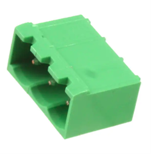
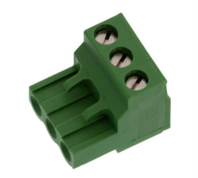
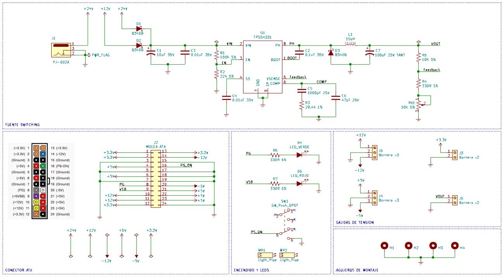
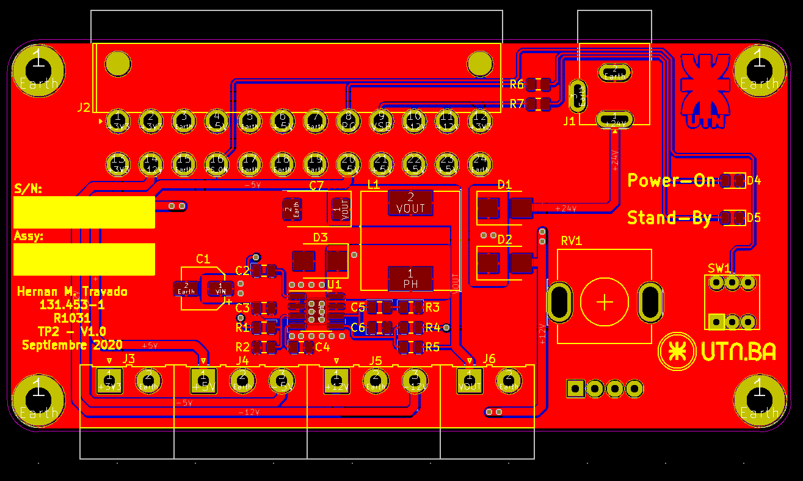
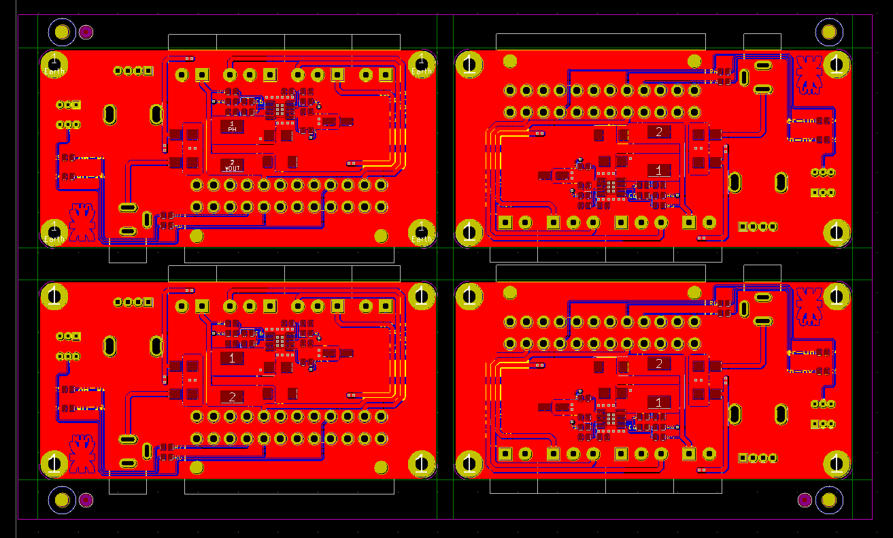

# Descripción del proyecto:

El objetivo de este proyecto es desarrollar una fuente switching de voltaje variable basada en el integrado TPS54331 de Texas Instruments. Como entrada vamos a poder utilizar una fuente ATX estándar de PC o una fuentes del estilo notebook de hasta 24 volts. La fuente proveerá una salida variable entre 1.5 volts y 24 volts la cual es ajustada mediante un potenciómetro. En el caso de alimentarse con una fuente ATX también se va a disponer de las salidas de 3,3v +5v + 12v -5v -12v.
La salida esta implementadas con borneras en dos piezas, quedando el macho adherido al PCB y una parte removible a la cual se podrán conectar cables mediante tornillos.

# Calculo de los componentes:
## Bloqueo por bajo voltaje de entrada:

* R1=  (V_START- V_STOP)/(3µA)=(6.8V-6.5V)/(3µA)=100KΩ
* R2=V_EN/((V_START- V_EN)/R1+1µA)=1.25V/((6.8V-1.25V)/100KΩ+1µA)=22123Ω

Asumo R2 = 22KΩ

## Arranque Suave:

T_SS (ms)=(C_SS (nF)x V_REF (V))/(I_SS (mA))=(10 x 0.8)/2=4 ms

## Calculo de R5 y R6:

Según la hoja de datos recomienda utilizar una resistencia de alrededor de 10K para R5, por esto asumimos inicialmente a R5 como 10K

R6 la calculamos según la siguiente ecuación:

R6=(R5 x V_REF)/(V_OUT-V_REF )

## Para obtener 4.5V a la salida:

R6=(10KΩ x 0.8V)/(4.5V-0.8V)=2162Ω 

Asumo R6 = 2.2KΩ por ser el valor comercial más cercano.

V_OUT=V_REF  x (R5/R6+1)=0.8V x (10KΩ/2.2KΩ+1)=4.44V

## Para obtener 6V a la salida:
R6=(10KΩ x 0.8V)/(6V-0.8V)=1538Ω

Como el valor comercial más cercano está muy lejos del valor que necesitamos vamos a cambiar R5 a 12K y vamos a repetir los cálculos.

R6=(12KΩ x 0.8V)/(6V-0.8V)=1845Ω

Asumo R6 = 1,8KΩ  por ser el valor comercial más cercano.

V_OUT=V_REF  x (R5/R6+1)=0.8V x (12KΩ/1.8KΩ+1)=6.13V

## Valores máximos y mínimos de la tensión de salida:

Si ahora tomamos fijo R5 = 10K y agregamos un potenciómetro de 10K con una resistencia de 330Ω en serie podemos calcular el voltaje máximo y mínimo que podemos tener a la salida.

V_MAX=V_REF  x (R5/〖R6〗_MIN +1)=0.8V x (10KΩ/330Ω+1)=25.04V

V_MIN=V_REF  x (R5/〖R6〗_MAX +1)=0.8V x (10KΩ/10330Ω+1)=1.57V

Cabe aclarar que para obtener el VMAX a la salida, la entrada tiene que tener el voltaje suficiente.

# Diagrama Esquemático:

# Circuito impreso

# Vista 3D de la placa terminada

# Panelizado del PCB

# Diseño del gabinete

# Link a ON-Shape:

https://cad.onshape.com/documents/020dfdbda6882e2ac2e1fa2c/w/ac47c3931b7ff00251a716d9/e/94a10833bc3fe93f9d4dad91

# Lista de Materiales (BOM):

Cantidad	Referencia	Fabricante	Fabricante P/N	Digikey P/N

1	C1	Panasonic Electronic Components	EEE-HB1V100R	PCE4153CT-ND

1	C2	AVX Corporation	08055C104KAT2A	478-1395-1-ND

2	C3, C4	Yageo	CC0805KRX7R9BB103	311-1136-1-ND

1	C5	Samsung Electro-Mechanics	CL21B102KBANNNC	1276-1020-1-ND

1	C6	Samsung Electro-Mechanics	CL21C470JBANNNC	1276-1156-1-ND

1	C7	KEMET	T491X107K025AT	399-8410-1-ND

3	D1, D2, D3	Diodes Incorporated	B340B-13-F	B340B-FDICT-ND

1	D4	Lite-On Inc.	LTST-C170KGKT	160-1414-1-ND

1	D5	Lite-On Inc.	LTST-C171KRKT	160-1427-2-ND

1	J1	CUI Devices	PJ-002A	CP-002A-ND

1	J2	Molex	39299242	WM7334-ND

2	J3, J6	TE Connectivity AMP Connectors	796644-2	A98248-ND

2	J4, J5	TE Connectivity AMP Connectors	796644-3	A98249-ND

1	L1	Bourns Inc.	SRR1260-150M	SRR1260-150MCT-ND

2	MP1, MP2	Visual Communications Company	LFB063CTP	LFB063CTP-ND

1	R1	Yageo	RC0805JR-07100KL	311-100KARCT-ND

1	R2	Yageo	RC0805JR-0722KL	311-22KARCT-ND

1	R3	Yageo	RC0805FR-0729K4L	311-29.4KCRTR-ND

3	R4, R6, R7	Yageo	RC0805JR-07330RL	311-330RARCT-ND

1	R5	Yageo	RC0805JR-0710KL	311-10KARCT-ND

1	RV1	Bourns Inc.	PTV111-3415A-B103	PTV111-3415A-B103-ND

1	SW1	E-Switch	TL2230EEF140	EG6031-ND

1	U1	Texas Instruments	TPS54331DDAR	296-39419-1-ND
